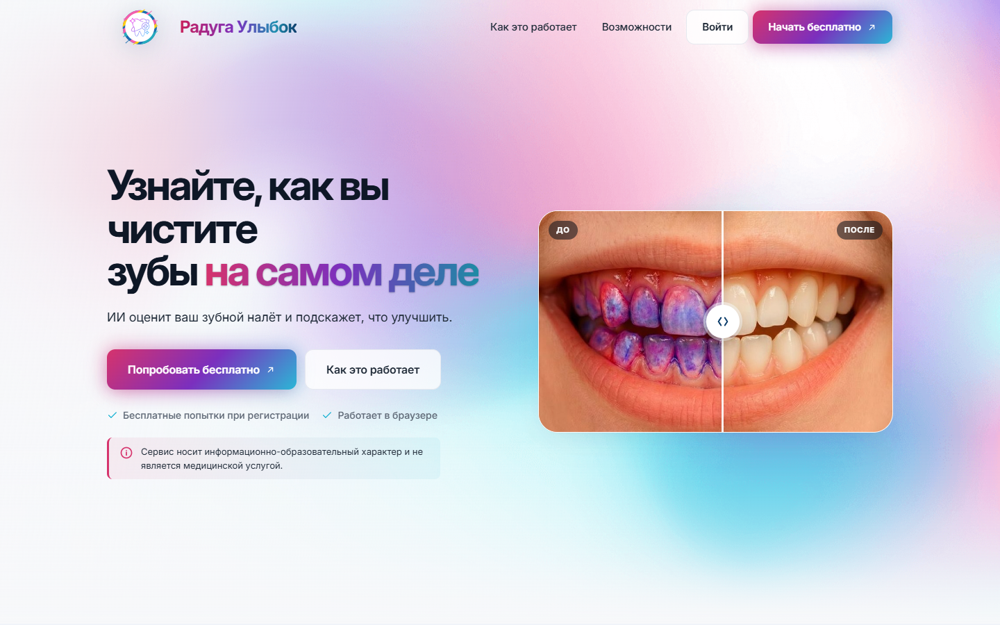
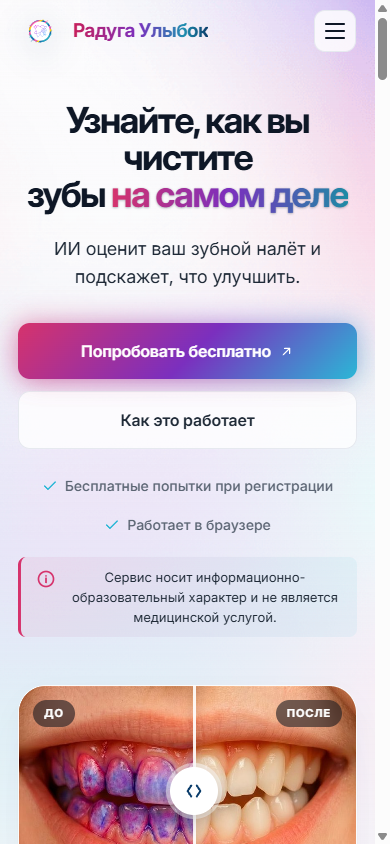

# Радуга Улыбок — AI-анализ гигиены полости рта

Веб-сервис, который по фотографии зубов автоматически оценивает уровень гигиены
полости рта и даёт пациенту понятные рекомендации по уходу. Пациент окрашивает
зубной налёт индикатором (двухцветный пищевой краситель), фотографирует зубы и
загружает фото — система измеряет площадь налёта, выставляет балл гигиены,
подсвечивает проблемные зоны и формулирует рекомендации.

Работает в браузере на компьютере и телефоне, без установки приложения.
Живой сервис: **[radugaulybok-dent.ru](https://radugaulybok-dent.ru)**

<p align="center">
  
</p>

<p align="center">
  
</p>

---

## Возможности

- **Анализ по фото с индикатором** — измерение площади налёта, балл гигиены 1–10,
  проценты свежего и зрелого налёта, проблемные зоны, подсветка налёта на фото,
  персональные рекомендации.
- **Экспресс-оценка без индикатора** — быстрый ознакомительный режим по одному фото:
  только качественные текстовые наблюдения, без баллов и процентов (без окрашивания
  налёт измерить нельзя).
- **Учёт возраста** — четыре возрастные группы (молочный, сменный, постоянный
  подростковый и взрослый прикус) со своим сценарием оценки для каждой.
- **История и динамика** — сохранение всех анализов, график динамики гигиены,
  «память» рекомендаций (сервис не повторяет советы, которые уже давал).
- **Роль «Эксперт»** — ограниченный доступ для стоматолога/гигиениста: просмотр
  пациентов, анализов и динамики, комментарий к анализу, выдача попыток, без доступа
  к настройкам системы.
- **Админ-панель** — управление пользователями, настройками нейросети и промптов,
  правовыми документами, содержимым лендинга; выгрузка анализов в CSV/Excel.
- **Защита данных** — медицинские фото хранятся на сервере в РФ (152-ФЗ), раздаются
  по временным подписанным ссылкам; явные согласия при регистрации, согласие
  законного представителя для детей.

## Как работает анализ

1. Пациент регистрируется и подтверждает согласия на обработку данных.
2. Указывает возрастную группу (для детей — согласие законного представителя).
3. Загружает фото зубов с окрашенным налётом.
4. Модуль компьютерного зрения (OpenCV, анализ цвета в модели HSV) находит область
   зубов и пиксели красителя, детерминированно вычисляет процент налёта — одно и то
   же фото всегда даёт один и тот же результат.
5. Мультимодальная нейросеть проверяет пригодность фото, называет проблемные зоны и
   пишет рекомендации; измеренные проценты передаются модели как факт.
6. Балл гигиены 1–10 выводится из суммарной площади налёта по фиксированной шкале.
7. Пациент видит результат, подсветку зон и сравнение с прошлым анализом.

## Технологии

| Слой | Технологии |
|------|-----------|
| Backend | Python 3.11, Django 4.2, Django REST Framework, аутентификация JWT (SimpleJWT), gunicorn |
| Frontend | React 18, Vite, Zustand, React Router, axios |
| Компьютерное зрение | OpenCV, NumPy (анализ цвета в HSV) |
| Нейросети | мультимодальная модель (Google Gemini через API / Vertex AI); переключаемо — Qwen3-VL (OpenRouter), GigaChat (Сбер) |
| База данных | PostgreSQL 15 |
| Кэш / счётчики | Redis 7 |
| Хранилище фото | локальный диск или S3-совместимое (MinIO) на сервере в РФ, presigned-ссылки |
| Инфраструктура | Docker, Docker Compose, Nginx 1.25 |

## Архитектура

Вычисления и хранение персональных данных разделены территориально: приложение
работает на одном сервере, а база данных и фотографии пациентов — на сервере в
России (требование 152-ФЗ о хранении персональных данных граждан РФ). Между
серверами поднят защищённый шифрованный канал; медицинские фото не задерживаются на
вычислительном сервере и раздаются браузеру только по временным подписанным ссылкам.

Подключение нейросети сделано через единый роутер (`apps/analysis/services/ai_router.py`),
поэтому модель можно переключать в настройках без изменения остальной логики —
измерение налёта и расчёт балла остаются неизменными.

## Структура репозитория

```
backend/          Django + DRF
  apps/analysis/  ядро: пайплайн анализа, CV-измерение налёта, интеграции нейросетей, история, динамика
  apps/users/     пользователи, роли (пациент/врач/админ/эксперт), регистрация, вход, согласия
  apps/core/      системные настройки, промпты, правовые документы, контент лендинга
  config/         настройки Django (base / test), JWT, кэш, маршруты
frontend/         React + Vite: лендинг, личный кабинет, анализ, результат, история, графики
nginx/            конфигурация веб-сервера и сборка статики
docker-compose.yml
.env.example      шаблон переменных окружения
DEPLOYMENT.md     пошаговое развёртывание
```

## Локальный запуск

Нужен Docker и Docker Compose.

```bash
# 1. Скопировать шаблон окружения и заполнить значения
cp .env.example .env

# 2. Поднять сервисы (backend, база, redis, nginx)
docker compose up -d --build

# 3. Применить миграции и создать администратора
docker compose exec backend python manage.py migrate
docker compose exec backend python manage.py createsuperuser
```

Минимально для анализа нужен ключ одной из нейросетей (Gemini / OpenRouter /
GigaChat) в `.env`. Хранилище фото на S3 и SMTP-почта опциональны: по умолчанию фото
пишутся на локальный диск, письма выводятся в консоль. Подробнее — в
[DEPLOYMENT.md](DEPLOYMENT.md).

## Тесты

Автотесты покрывают пайплайн анализа, расчёт балла, кэширование, роли и права,
публичные эндпоинты и согласия.

```bash
docker compose exec backend python manage.py test --settings=config.settings.test
```

## Безопасность и данные

- Секреты (`.env`, ключи API, сервисный ключ Google в `secrets/`) в репозиторий не
  попадают — только шаблон `.env.example` с плейсхолдерами.
- Фотографии пациентов — медицинские персональные данные: хранятся в РФ, доступ по
  временным ссылкам, обработка только с явного согласия.
- Доступ к разделам разграничен по ролям на уровне системы.

## Статус

Проект в продакшене и развивается. Репозиторий содержит исходный код сервиса;
инфраструктурные скрипты с доступами к серверу в него намеренно не включены.
